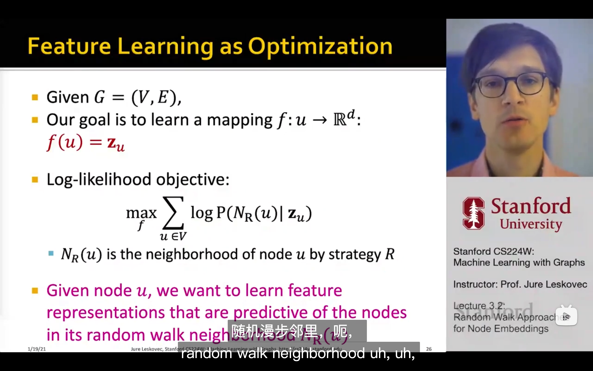
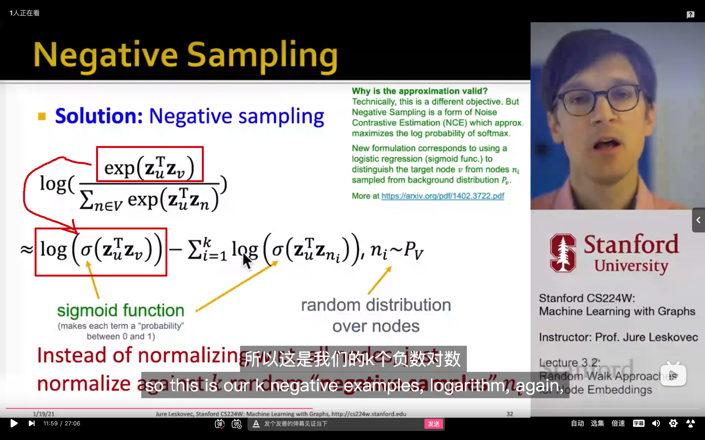
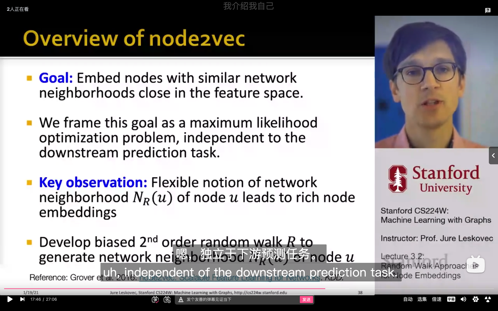
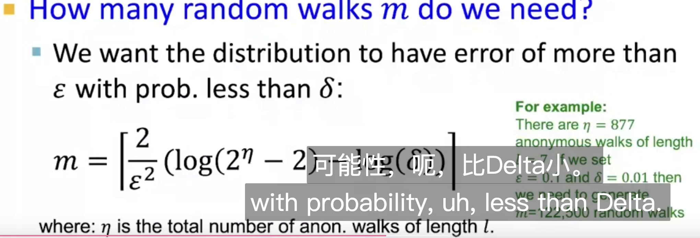
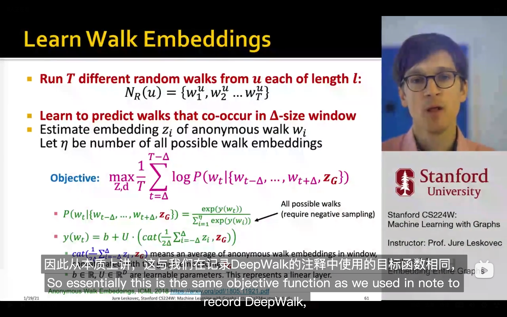
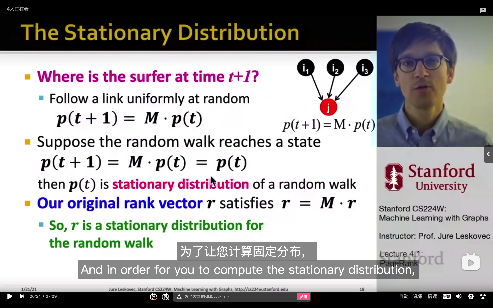

这个公式代表最大的概率是吗?为什么要让它最大?(可能涉及到一些基础的知识)

红色框框里的是怎么得出来的呀, 为什么exp会变成$\sigma$???

一个概念性的问题, 什么是下游预测任务??

这个数学公式,为什么只要满足m个数量的random walks就可以使错误率小于... 还有$\epsilon$和$\delta$分别代表什么意思呢?

***救命, 这么多公式我看不懂啊!!!***

这里为什么会收敛啊???