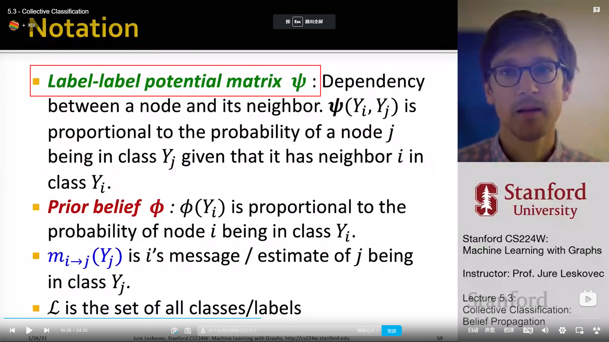
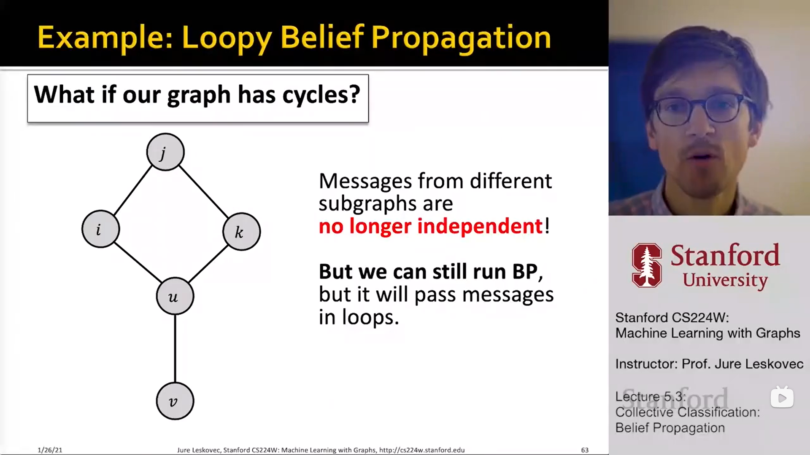
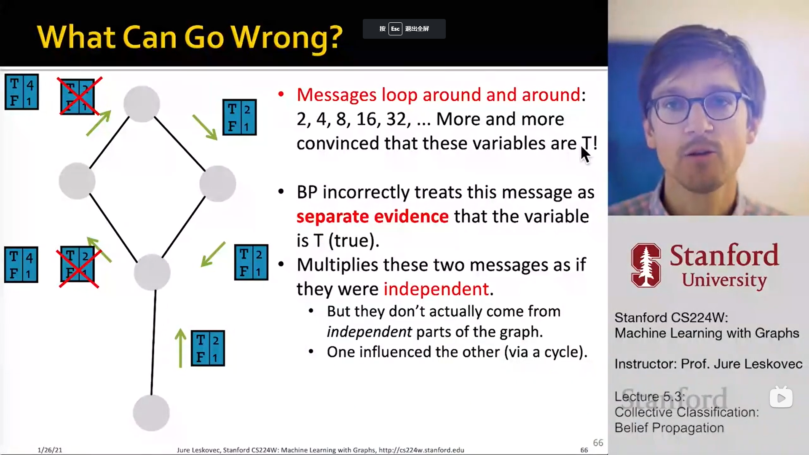
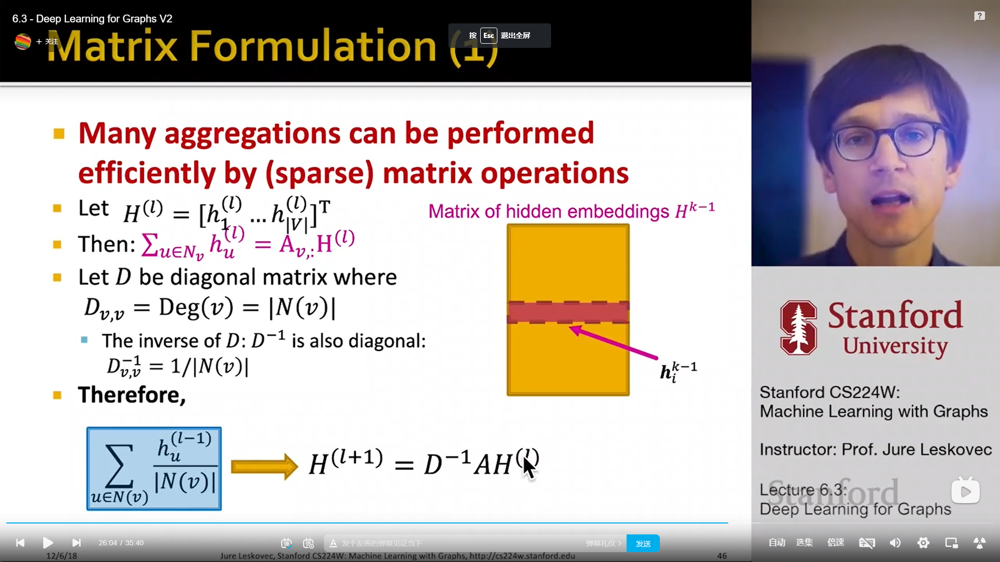

# [5.3 collective classification](https://www.bilibili.com/video/BV1RZ4y1c7Co?p=16&vd_source=50d90e3800a4d748295727d11723ed9f) -- 就像收集信息一样, 把节点信息收集起来再进行分类.(semi-supervised learning)

## 1. 感觉label-label potential matrix 的定义有点乱

我对它的理解:

- $\Phi(Y_i, Y_j)$ 代表的是: 如果 node j 有一个邻居 i , 给定**邻居的标签为$Y_i$**, **节点 j 的标签是 $Y_j$** 的概率. (感觉好绕)

---

## 2. loopy belief propagation

**不太理解这个更新的策略是啥, 看一下视频的相应部分解释一下⑧**

# [6.1 Graph Neural Networks -- 神经网络来咯](https://www.bilibili.com/video/BV1RZ4y1c7Co?p=17&vd_source=a63991d768ee9a355deb3fafeabf6a7b)

# [6.3 deep learning for graphs](https://www.bilibili.com/video/BV1RZ4y1c7Co?p=19&spm_id_from=pageDriver&vd_source=50d90e3800a4d748295727d11723ed9f)

**线性代数**的问题啊啊, **为什么 aggregations 能用这种矩阵形式表示出来**, 从 diagonal matrix 后面就不懂了 