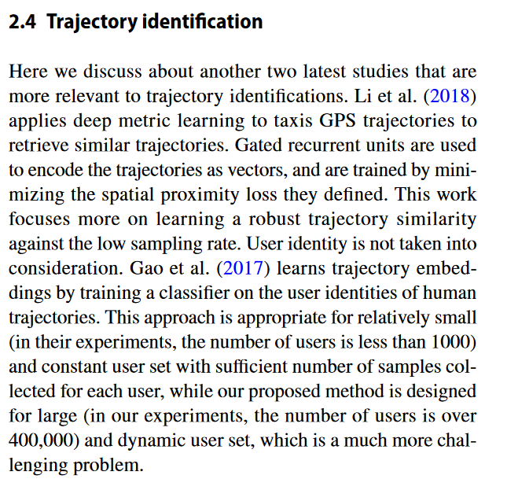
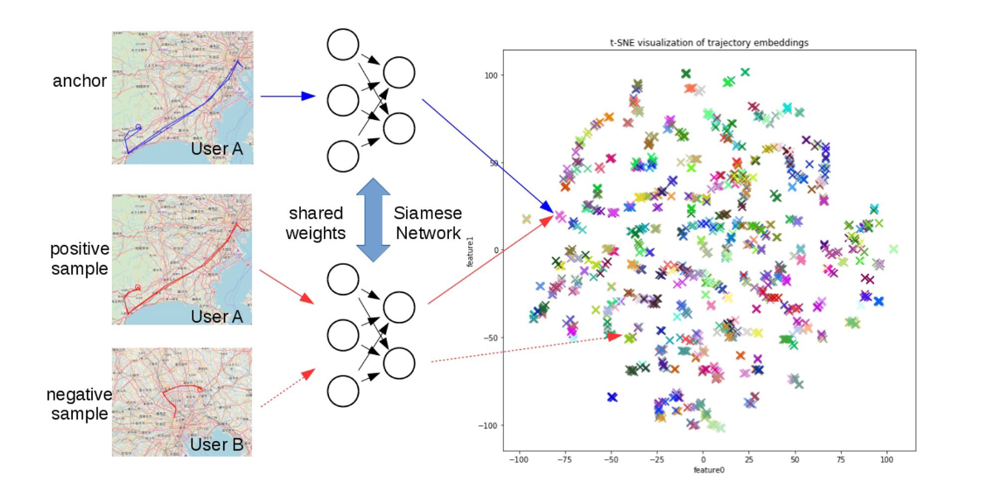

# Trajectory fingerprint: one-shot human trajectory identification using Siamese network

## 出处：CCF Transactions on Pervasive Computing and Interaction

这篇论文是关于人类轨迹识别的

**Keywords：** Human mobility modeling · Siamese network · One-shot learning

[one-shot learnning](https://blog.csdn.net/junbaba_/article/details/110218860): One-shot learning 指的是我们在训练样本很少，甚至只有一个的情况下，依旧能做预测。**Instead of learning the user-specific information from the training data, one-shot learning algorithms learn how to extract discriminative features for each user and measuring the similarity between users.**

### 问题描述 
与 robust 的生物测定比如指纹识别相比, 人类的轨迹在识别一个用户身份的表现更为模糊, 主要有两种原因:

1. 传感器和电池技术的限制可能会导致 non-uniform sampling at a low average rate and inaccurate positioning, 进而导致不可恢复的精度损失
2. 相同用户的轨迹每一天都不一样

When the user set is small and constant (we do not need to add new users or delete inactive users frequently), and we could collect sufficient number of samples for each user in the training set, trajectory identification could be formulated as a classification problem and solved in a supervised learning framework. （当用户数据量比较小并且是确定的，我们就可以有效地收集到这些轨迹信息来训练, 就可以将它划分一个分类问题, 可以用监督学习的框架来解决它）

However, for many real world human trajectory databases, the sets of users are too large and dynamic, because numerous temporary and inactive users take up a large portion of the dataset. As the results, training a supervised classifier that learns all the discriminative features for each individual on such a large scale and dynamic user set is infeasible.（然而, 在现实世界中用户数据集太大了, 因为临时用户和不活跃用户占整个数据集很大的一部分比例, 这导致了学习不同用户的discriminative features变得困难）

### 解决方法: One-shot learning
As a special case of transfer learning, one-shot learning transfers the knowledge from identifying one user to another through the reuse of model parameters, and therefore it overcomes the problem of large and dynamic user set, as well as small sample size (as less as 1) for each user.

- 作为迁移学习的一种特殊形式, one-shot learning 能够通过模型参数的复用, 从一个用户到另一个用户之间传输知识. 所以可以克服 the problem of dynamic and large user set.

One of the most famous one-shot learning method, Siamese network, which is widely used in signature verification (Bromley et al. 1993), face recognition (Koch et al. 2015) and multi-person tracking (McLaughlin et al. 2016), has become a natural choice in learning to extract discriminative features from large-scale database.

- siamese network 也是一种 one-shot learning method, 应用于签名验证(Bromley et al. 1993), 人脸识别(Koch et al. 2015) 和 multi-person tracking (McLaughlin et al. 2016)

## 在论文中引用的地方: 2.4 轨迹识别

## 论文中用到的方法

人类轨迹的深度度量学习的可视化:

经过 Siamese NN 映射到一个二维空间(假设空间中只有两个特征), 相似的轨迹之间的距离小, 不相似的轨迹之间距离大.
